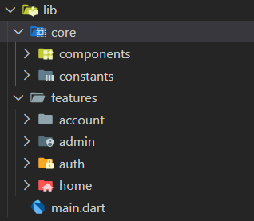

# 🏎️ Garage

<!-- Preview Image -->

  

## ℹ️ Overview
Garage is a modern car marketplace application built with **Flutter** and **Supabase**.  
It allows users to **browse, filter, and book cars** based on their preferred brand.  
Each user can **create an account**, verify it via email, and manage their profile with a personal photo.  
Admins have access to a dedicated **Dashboard (Admin Page)** to manage the listed cars and system data.

---

## ✨ Features

### 👤 User Features
- User registration with **email verification**.
- **Login / Logout** using Supabase Authentication.
- Browse cars by brand (BMW, Lamborghini, Ford, etc.).
- View detailed car information (price, specs, images).
- Book a car — sends an **automated WhatsApp message** to the showroom owner.
- View and edit user profile with profile picture and info.

### 🛠️ Admin Features
- Manage all cars from the **Admin Page**.
- Validate and upload car data with proper rules (engine size, speed, seats, etc.).
- Manage storage (images uploaded to Supabase Storage “cars” bucket).
- Access all user bookings and car details.

---

## 🧱 Project Structure

---

## 🧰 Tech Stack

- **Flutter** — Frontend Framework  
- **Supabase** — Backend, Authentication & Database  
- **Supabase Storage** — For car and profile images  
- **WhatsApp API (URL launch)** — For booking communication  
- **Dart** — Core programming language  

---
> **Developed with ❤️ using Flutter.**
